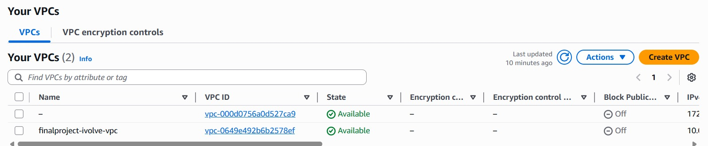
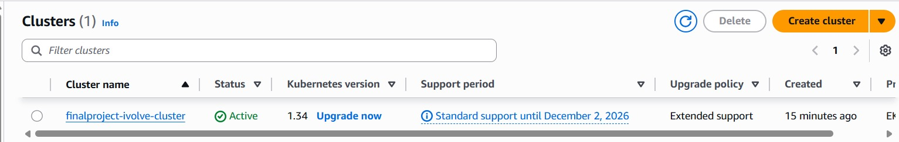
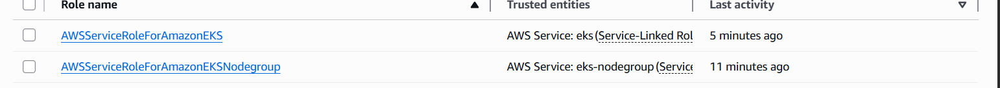
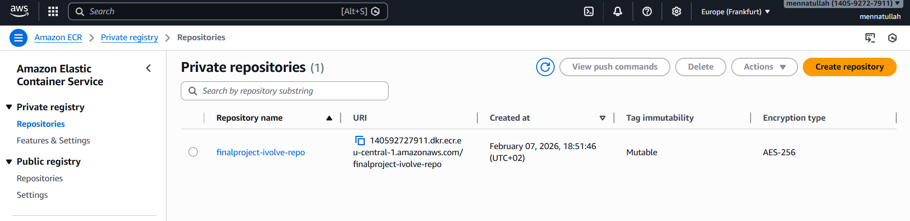
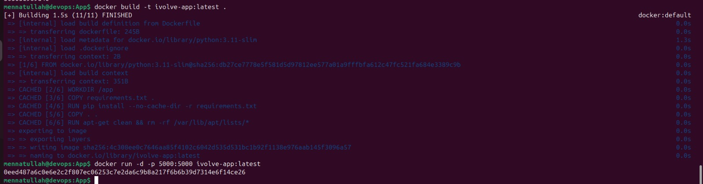
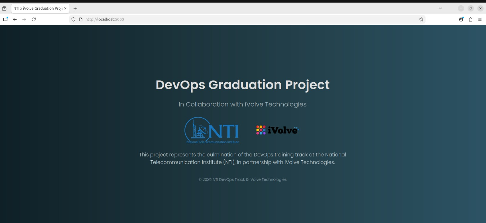

# Cloud DevOps Project Documentation

## Project Overview

This project demonstrates a full Cloud DevOps pipeline for the iVolve application. It integrates modern DevOps practices to automate building, deploying, and monitoring the application.

- Containerization: Docker
- Container Orchestration: Kubernetes (EKS)
- Infrastructure as Code (IaC): Terraform
- CI/CD Pipeline: GitHub Actions
- Application Deployment Management: ArgoCD & Kustomize
- Security & Monitoring: Trivy scans for containers

The workflow automates building, scanning, pushing images, and deploying updated applications to the Kubernetes cluster.

---

## 🌐 Infrastructure Overview

The infrastructure is built using **Terraform** and AWS resources:

### 1. VPC (Virtual Private Cloud)
- CIDR block: `10.0.0.0/16`
- Public and private subnets across **two Availability Zones** for high availability.
- DNS support and hostnames enabled.



### 2. Subnets
- **Public Subnets**: For NAT Gateway, Internet Gateway, and public-facing resources.
- **Private Subnets**: For EKS worker nodes and private resources.


### 3. Internet Gateway (IGW)
- Allows public access to resources in public subnets.


### 4. NAT Gateway
- Deployed in public subnets to provide internet access to private subnets.


### 5. Route Tables
- Public route table: Routes `0.0.0.0/0` traffic through IGW.
- Private route table: Routes `0.0.0.0/0` traffic through NAT Gateway.

### 6. VPC Endpoints
- ECR API endpoint for private communication between EKS nodes and ECR.
- Private DNS enabled.

### 7. EKS Cluster
- Managed Kubernetes cluster using **Amazon EKS**
- **Two worker nodes**, deployed in separate private subnets
- Worker nodes type: `t3.medium` (Free Tier eligible for testing)



### 8. Node Group


### 9. IAM Roles
- Roles for EKS cluster and worker nodes to allow AWS resources access.



### 10. ECR Repository
- For storing Docker images for deployment in the cluster.



---

## ⚙️ Terraform Modules

- `modules/vpc` → VPC, subnets, route tables, NAT, IGW  
- `modules/eks` → EKS cluster and node groups  
- `modules/roles` → IAM roles for cluster and nodes  
- `modules/ecr` → ECR repository  
- `modules/endpoints` → VPC endpoints  

---

## 🛠️ Variables

```hcl
variable "project_name"       # Project name
variable "aws_region"         # AWS region (e.g., eu-central-1)
variable "availability_zones" # List of AZs for subnets
variable "cidr_block"         # VPC CIDR block
variable "public_cidr_blocks" # Public subnets CIDR
variable "private_cidr_blocks"# Private subnets CIDR
variable "default_route"      # Default route (usually 0.0.0.0/0)


## 🛠️ Setup & Deployment

Follow these steps to deploy the infrastructure:

### 1. Configure AWS Credentials
Make sure your AWS CLI is configured:
```bash
 vim ~/.aws/credentials
```
 put your aws credentials in the file 


### 2.Initialize Terraform
Download provider plugins and initialize your Terraform workspace:
```bash
terraform init
```
### 3. Validate Terraform Configuration
Check your Terraform files for any syntax or configuration issues:
```bash
terraform validate
```


### 4. Apply Terraform to Deploy
Create the infrastructure on AWS:
```bash
terraform apply -auto-approve
```

#### This will create:

- VPC, public and private subnets

- Internet Gateway and NAT Gateway

- Route Tables and associations

- EKS cluster with two worker nodes

- ECR repository

- VPC Endpoints


## 🚀 Build & Run Docker Image Locally

You can build and test the iVolve application locally using Docker.

### 1️⃣ Build the Docker Image
Build the image from the Dockerfile in the current directory:

```bash
docker build -t ivolve-app:latest .
```

2️⃣ Run the Container Locally
Run the container and map port 5000 from the container to 5000 on your local machine:
```bash
docker run -d -p 5000:5000 ivolve-app:latest
```

3️⃣ Verify the Application
Check that the application is running:
```bash
curl http://localhost:5000
```




## 🐳 Docker & Build Tools

The application was containerized using Docker to ensure consistency across development and deployment environments. The workflow included:

1. Build & Dependencies

- Install required Python packages using in the Dockerfile:
    ```bash
    pip install -r requirements.txt
    ```

    Ensured all dependencies are defined in requirements.txt for reproducibility.

2. Dockerfile Creation

-  Created a Dockerfile defining the environment for the application.

   Set up the working directory, copied the application code, installed dependencies, and exposed the necessary ports.

3. Docker Image Build & Push

- Build the Docker image :
    ```bash
    docker build -t <image_name>:<tag> .
    ```

    Tagged and pushed the image to the AWS ECR repository:
    ```bash
    docker tag <image_name>:<tag> <aws_account_id>.dkr.ecr.<region>.amazonaws.com/<repo_name>:<tag>
    docker push <aws_account_id>.dkr.ecr.<region>.amazonaws.com/<repo_name>:<tag>
    ```

This setup allows the application to run consistently across all environments, simplifies deployment, and integrates directly with Kubernetes via EKS.


